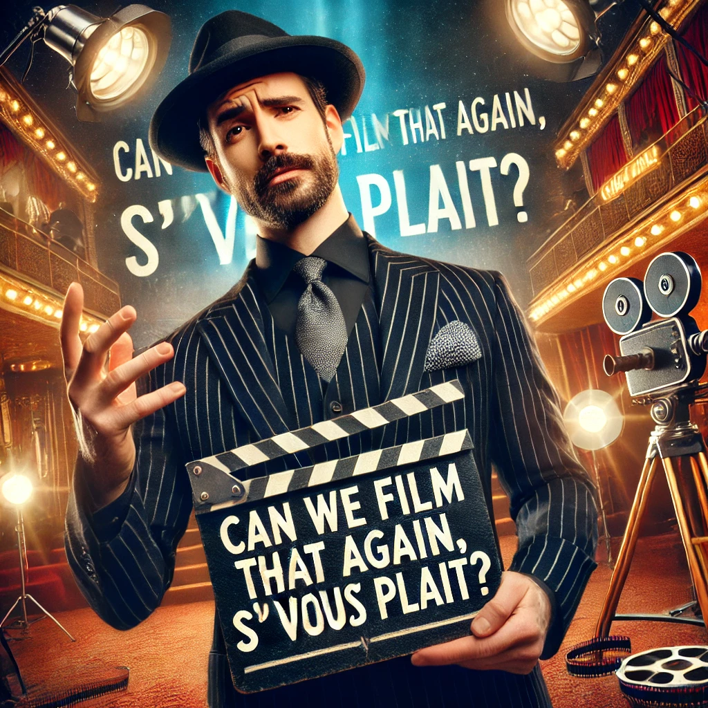

# Can we Film that Again S'IL VOUS PLAIT? Unveiling Trends in Movie Remakes

|  |
|:--:|
| *generated using GPT/DALL-E* |

## Abstract

The film industry has long been captivated by the allure of remaking classic movies, offering fresh takes on beloved stories to new generations. The motivation behind this project stems from a curiosity about the cyclical nature of storytelling in cinema and the industry's reliance on nostalgia. This project aims to delve deep into the phenomenon of movie remakes by analyzing films spanning decades to uncover patterns that explain why certain movies are chosen for remakes, their differences from their originals, and the factors contributing to their success or failure. By examining genre popularity, revenue, critical reception, and temporal gaps, we seek to tell the story of how and why the film industry reinvents existing narratives. This analysis will not only highlight the evolving tastes of audiences but also provide insights into the decisions made by filmmakers and studios. Perhaps as history repeats itself, so do pivotal movies of the generations.

## Objectives

During our project, we would like to tackle the following questions: 
1. What key features or metrics make an original movie more likely to be remade?
2. Some movies have more than one movie remake. Is there anything different in those movies compared to other remakes?
3. Do original movies and reboots have similar contexts (historical events)?
4. Investigating the genre information for movie remakes.
5. How diverse are the crews of the movie remakes compared to original ones?
6. Do movie reboots have higher revenue than originals factoring the inflation? (Comparing the revenues of the remade films with the original ones and the whole movie dataset (adjusting with inflation))
7. Investigating time intervals between the remakes, how long does it take to remake a movie?
8. Applying sentiment analysis on movie plots with LLMs, does it affect a movie being remade, and is there a difference between the sentiment of a movie and its remake.
9. Searching for social keywords in the plot and seeing whether it affects the remakes.
10. Predicting future remakes and comparing them with LLM predictions / real data of future movies. Can we predict movie remakes and the time between the remakes?
11. How popular are remakes compared to originals?
12. What is the effect of multiple prominent movie stars present in the movie?

## Datasets

Our project focuses on the CMU Movie Summary Corpus, a dataset that includes information about movies and their characters. However, we require data on movie remakes, and the CMU dataset has to be cleaned and enriched for our task, as described below.

### Wikipedia Movie Remakes

We extracted data from Wikipedia's "List of film remakes" pages (1, 2) and organized it into a tabular format. Afterward, to integrate the crawled data into the base CMU dataset, we retrieve the corresponding WikidataIDs for each movie using its URL.

### TMDB

To address the limitations of the CMU dataset—such as missing values, missing records for remade movies, and its limited feature set—we enhanced it using an offline version of TMDB data from Kaggle. This enrichment process involved:

- Adding missing records related to remade movies.
- Incorporating additional features (e.g., budget).
- Filling gaps in the data using TMDB values.

Additionally, we identified and corrected noisy records in the CMU dataset by cross-referencing them with TMDB, resulting in a more consistent and reliable dataset.

### Google Knowledge Graph

** MARIA S'IL VOUS PLAIT**

and we utilize the Google Knowledge Graph to retrieve Freebase codes for ethnicities. 

** MATIN AND AMIR S'IL VOUS PLAIT**

## Methods
- Show that the method works well on a simple example

## Proposed timeline
## Organization within the team: A list of internal milestones up until project Milestone P3.
## Questions for TAs (optional): Add here any questions you have for us related to the proposed project.
